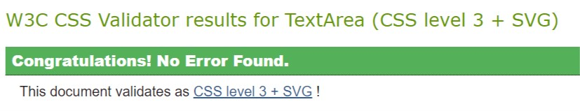
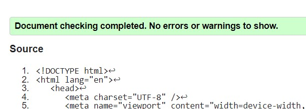

# Embarr Equestrian Trivia Challenge 

## Overview

Embarr Equestrian Trivia challenge is a website page designed to be part of a bigger site for example Embarr Equestrian . The quiz page is targeted at horse owners or horse lovers  that would like a simple fun interactive way of learning about general horse knowledge or care.

The page design was developed with mobile responsiveness at the forefront. It consists of one html page that should be developed further with improvements to the page structure in order to integrate with its master website [Embarr Equestrian - Deployed Site Link](https://chellej80.github.io/Embarr-Equestrian/). 

The Quiz consists of ten shuffled questions that are presented with multiple choice question either two options or four options. When the user selects an answer, the correct one turns green and the wrong one turns red. The quiz result/score is incremented and on completion of the Quiz the user has the option to 'Try Again'.

<h2>
Site Mockup
</h2>

## The quiz goals are:

* Provide a fun interactive learning experience
* Provide a great user experience on all mobile devices
* Be easy to navigate
* Give clear calls to action
* Function in a logical correct way

## User Stories

### First Time User 

- I want to be able to navigate the site page/ quiz and understand its objectives clearly without confusion. 
- I want to clearly understand how to complete the quiz.

### Returning/ Regular Visitor

- I would like to see more quiz options on a range equine topics for adults and children.
- I would like to see quizs updated & refreshed monthly with new challenges.

### Target Audience

- Equine enthusiasts that want to learn more about equine general knowledge/ horse care in a simple fun interactive way.

 

## Features 

### The About Section

#### Contains:

- __Title__

 - __Logo__

    The logo I created simply using a combination of text and a font awsome icon. 
    
    

- __Quiz Text__

The Quiz text is a short simple description of the quiz and how to navigate it. If the quiz is developed further, more detailed instructions may be necessary. Currently the structure of the quiz is simple and structured so the user is presented with a clear navigation path through the quiz, without the need for excessive instructions.

### The Hero Image

- __The page hero image__

The landing page includes a hero image of a horse with a text overlay to allow the user to quickly see exactly what the site quiz is about.
This section introduces the user to Embarr Equestrian with an eye catching hero image to grab their attention.

### Features Left to Implement
- Additional features 
    - UserName and login features
    - A dedicated 404 page 
    - Add a progress bar.
    -  Let users review answers before submitting.
    - Give users a summary of their answers after they submit.
    - Update the navigation to let users skip to any question number.
    - Create custom messages for each level of results. For example, if someone scores 8/10 or higher, call them a quiz ninja.
    - Add a button to share results to social media.
    - Save your high scores using localStorage.
    - Add a countdown timer to see if people can beat the clock.
    - Hide the text when starting the quiz. 
    - Integrate the quiz page with the main master website, add a header/ navigation/ further quiz sections of various levels/ topics & footer.
       

## Languages Used
- Javascript
- HTML
- CSS

## Frameworks, Libaries and technologies used

- [Git/ Github](https://github.com/) - Git/Github was used for version control, storage and deployment of the project.
- [Font awesome](https://fontawesome.com/) - Font awesome icons were used throughout the site and for the logo creation.
- [Google Fonts](https://fonts.google.com/) - Were used to import the Merriweather font used throughout the site.

- [Hover: CSS](https://www.w3schools.com/cssref/sel_hover.asp) - Was used to created the pop effect for the linked three images on the landing page and the colour hover effect   in navigation menu & slideshow next/prev arrows.
- [Javascript](https://www.w3schools.com/w3css/w3css_slideshow.asp) - JS script was used to action the manual slideshow function.
- [Squoosh](https://squoosh.app/) - This was used to prepare the images for web optimisation
- [Techsini](https://techsini.com/multi-mockup) - This was used for the mockup image in the overview.

## Testing Conducted 

### Usability testing 

I tested the quiz application thoroughly and repetitively throughout the Javascript coding, using console.log() where necessary and the dev tools in chrome for debugging. 
I also had work colleagues and family members assistance to test the site usability. 
I tested all quiz buttons/ actions/ functions to ensure that they were working as expected.
I tested the quiz logic was working as expected.

Test Script actioned:

1. Navigate to page
2. Review Quiz text
3. Click on button 'Play the Quiz'
4. Result - Quiz loads as expected with the 1st Question and multiple choice answers & 'Play Quiz button is hidden'
5. Select answer - The Correct answer turns green/ the wrong answers turn red.
6. On selecting an answer the 'Next' Button appears, the current answer buttons no longer can be actively selected and the score result is updated.
7. On clicking the 'Next' button the question/ answer containers are cleared and a new question is loaded, if the question only has two choices as opposed to four the answer grid appends accordingly.
8. On conclusion of answering all Questions the endgame function is actioned and a message of 'Quiz completed' is displayed with the final result and the 'Try again' button is enabled which on click refreshes the page so the user can complete the quiz again, clearing the Quiz and enabling the 'Play the Quiz' button.
9. Repeat the above steps a number to times to ensure that the questions are being loaded in a shuffled logic.

The conclusion of repeating the above test script multiple times was that:

- The quiz page and quiz itself was understandable and easy to use.
- All Buttons with eventlistners/ functions on completion of testing are working as expected.
- The Shuffled question logic is working as expected.
- The correct color hue is being loaded on selection of an answer - red for wrong/ green for correct.
- The results/ score is being incremented correcly.
- The quiz only actions the endquiz function once all questions have been answered.
- The select/ click action is disabled once a question is selected, it is only possible to move forward with the quiz by seclecting 'Next'
- The 'Play Quiz' button hides as expected on initialising the quiz.
- The 'Next' button only appears once a question has been answered.
- The Restart button only appears for the end quiz.

### Content 

I reviewed all content on the site for:
- grammar and spelling mistakes
- Images are placed properly with proper sizes &    displaying as expected
- Instructions are clear and contain correct information
- Verified all text/ headings are displaying correctly

### Effects Testing 

I tested that all hover effects were working for the buttons.

### Performance

I ran the site through the lighthouse performance tool for developers: 
[Lighthouse](https://developers.google.com/web/tools/lighthouse)

Given more time I would look at the passive listeners to improve scrolling performance, and also the images/ youtube videos in order to improve the performance score

### Responsiveness

I used chrome developer tools, [Techsini](http://techsini.com/multi-mockup/index.php) & [ami](http://ami.responsivedesign.is/#) throughout all development of the site to ensure that it was responding to all devices down to 300px - 360px width

I tested the site responsiveness on my iphone/ ipad and my family/ friends android mobile devices to ensure the page was rendering and functional across a range of devices.

As the quiz is contained in a flex container and the design is basic , media queries were not necessary, however once the page is further developed these would be considered, actioned and tested accordingly. 

### Javascript Validation

I ran the JS Code through [JShint](https://jshint.com/)

No errors detected

### CSS Code Validation
I ran the CSS Code through the following validator:
[Jigsaw](https://jigsaw.w3.org/css-validator)

There were no errors detected

### HTML Code Validation

I ran the HTML Code through the following validator:
[Jigsaw](https://jigsaw.w3.org/css-validator)

Once two stray div elements were removed no warnings/ errors were reported.

### Autoprefixer CSS

I ran the code through the [Autoprefixer](https://autoprefixer.github.io/) and copied the parsed CSS back into my project.

### Bugs

In my testing I discovered a couple of bugs that I fixed:

1. The score was incrementing on navigation through the quiz questions - this was resolved by using an if statment within the funtion onOptionClick so that the score would only increment if the answer was 'correct'.
2. The score was incrementing if the user clicked the correct answer button multiple times - this was resolved by removing the 'click' event listner ability once the user had made their selection.

There are now no known unfixed bugs to report.

## Credits

### JavaScript:

Code inspired and adapted from the following tutorials and sources:
- https://www.sitepoint.com/simple-javascript-quiz/
- https://simplestepscode.com/javascript-quiz-tutorial/
- https://www.youtube.com/watch?v=f4fB9Xg2JEY&list=WL&index=14
- https://www.youtube.com/watch?v=w-OKdSHRlfA&list=WL&index=13
- https://flexiple.com/disable-button-javascript/
- https://www.youtube.com/watch?v=jvk1pFNqXaw&t=1300s
- https://stackoverflow.com/questions/28610365/how-can-i-add-an-event-for-a-one-time-click-to-a-function
- https://www.youtube.com/channel/UCFbNIlppjAuEX4znoulh0Cw

### Hero Image: 

- Tutorials from [W3schools](https://www.w3schools.com/howto/howto_js_topnav_responsive.asp),  [Elementor](https://elementor.com/blog/hero-image/?utm_source=google&utm_medium=cpc&utm_campaign=11138809851&utm_term=&gclid=Cj0KCQiA2ZCOBhDiARIsAMRfv9JNeu2cN7Oh6WGv706wIViKg2tBoXlBjhg9Zw9Wkd9m3fQOmdY_Fp0aAtXIEALw_wcB) & from the [Love Runnning Module](https://learn.codeinstitute.net/courses/course-v1:CodeInstitute+LR101+2021_T1/courseware/4a07c57382724cfda5834497317f24d5/6fd29d155c3b42248ff57bae32978a4b/).  
- The image used was purchased from [Shutterstock](https://www.shutterstock.com/)  

### Responsiveness: 
- Tutorials & flexbox code adapted from [Flexfroggy](https://flexboxfroggy.com/), [W3schools](https://www.w3schools.com/howto/howto_css_responsive_text.asp
), [CSS tricks](https://css-tricks.com/snippets/css/a-guide-to-flexbox/), [CSS grid versus flexbox](https://webdesign.tutsplus.com/articles/flexbox-vs-css-grid-which-should-you-use--cms-30184), [Webdev](https://web.dev/responsive-web-design-basics/)

### Hover/ Box Shadow Effects

- Code taken from [Mozilla](https://developer.mozilla.org/en-US/docs/Web/CSS/:hover) & [Box Shadow](https://getcssscan.com/css-box-shadow-examples)

### Text Blocks

- Code adapted from [Mozilla](https://developer.mozilla.org/en-US/docs/Web/CSS/Containing_block
)

### Content

All content was written by the project owner.

### Media

- The hero image (purchased from Shutterstock) 

### Readme 

- I used the 
[Markdown cheat sheet](https://github.com/tchapi/markdown-cheatsheet/blob/master/README.md) and the [love running template ](https://github.com/Code-Institute-Solutions/readme-template )to help put together my readme.

# Deployment

- The site was deployed to GitHub pages. The steps to deploy are as follows: 
  - In the GitHub repository, navigate to the Settings tab 
  - From the source section drop-down menu, select the Master Branch
  - Once the master branch has been selected, the page will be automatically refreshed with a detailed ribbon display to indicate the successful deployment. 

  - On submission the project it is forked, by forking the project a copy of the original repository is made that can be viewed without affecting the original repository by following these steps: In the GitHub repository, locate the settings, above this is the option to 'fork', select this to create a copy

The live link can be found here - [Embarr Equestrian Trivia Challenge - Deployed Site Link](https://chellej80.github.io/Embarr-Equestrian-Trivia/)